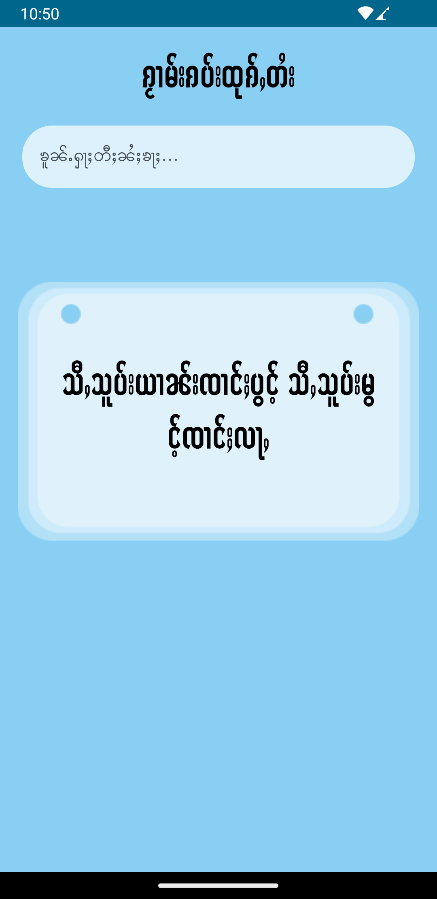
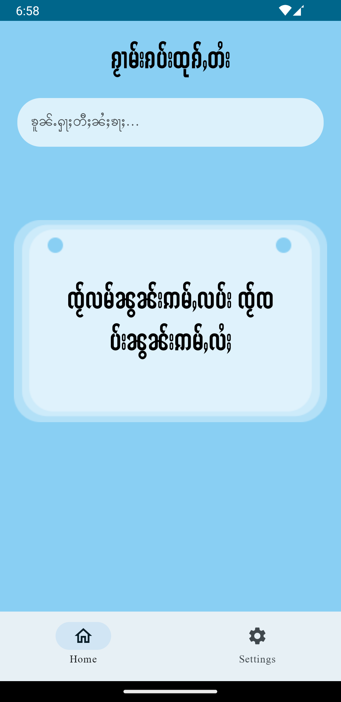
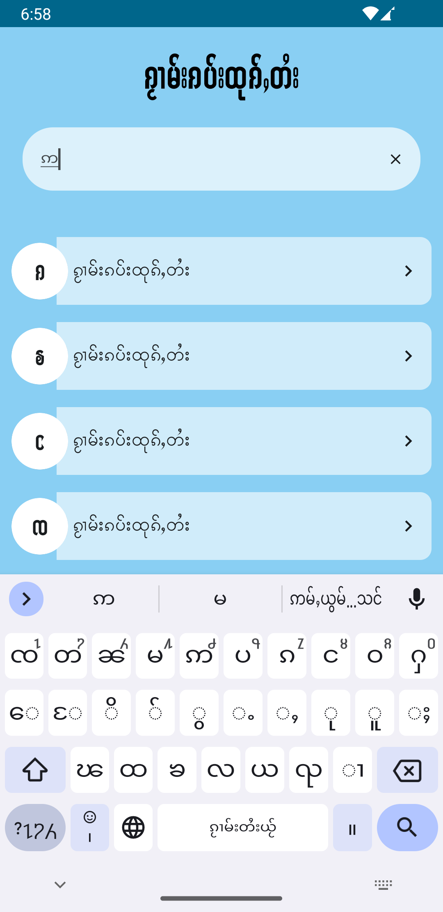
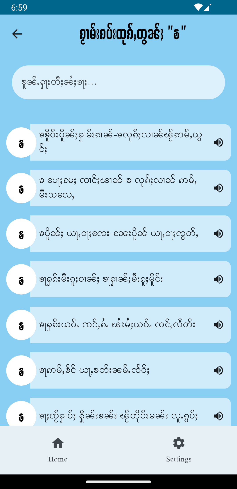
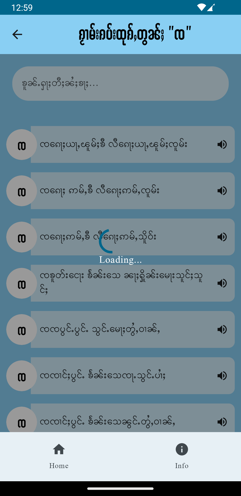

## TaiQuotes for Android App
- Learn Shan or Tai language from this app with Shan voice generator from AI.

## Dependencies for App
- Jetpack Compose
- ViewModel
- Retrofit2
- Dragger Injection

## Specialist of this App
- User can listen with voice generator

## Available on Play Store

## Demo
   Android Screen | Android Screen
:-------------------------: | :-------------------------:
 | 
 | 
 | 

### Donate Me
| SHIBU | BTC | ETH | DOGE |
| :----------: | :-----------: | :-----------: | :-----------: |
|  |  |  |  |
